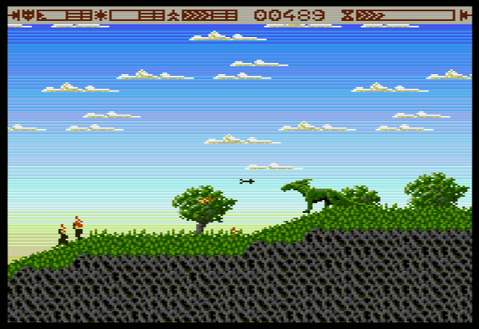

Flight of a Dragon
==============================================================================

:Author:    Sandor Zsuga (Jubatian)
:License:   GNU GPLv3 (version 3 of the GNU General Public License)

Overview
------------------------------------------------------------------------------

Flight of a Dragon is a runner - platformer game for the Uzebox console
(http://www.uzebox.org) featuring a flightless dragon as protagonist who must
escape from his prison in an empire which wanted to break and train him to
use him as a war machine in their conquests.

As such he is a powerful fire-breather who can easily storm through
opposition, however the empire has a large and well equipped military all
around who can grind him down if he wasn't careful. It is also important to
be fast, to flee before forces could be mustered to thwart his attempt.

He doesn't want bloodshed, to be remembered as a monster, so he should be
cautious to not cause more losses than necessary, and he may also help people
(prisoners) on his way, supporting a probable uprising against the power.

Requirements
------------------------------------------------------------------------------

For playing the game you either need an Uzebox (or build something compatible
using an ATMega644p), see http://www.uzebox.org, or use an emulator such as
CUzeBox or Uzem. For peripherals you need an SNES controller only (no SD card
is required).

Game binaries are provided (a .hex and a .uze file, the former can be burned
in the ATMega directly, the latter can be used with Uzeboxes with an SD card
slot and a bootloader) in the _bin_ folder, so you don't necessarily need to
compile if you just want to play it.

Compiling the game
------------------------------------------------------------------------------

You need the avr-gcc toolchain to compile the game. It should build fine using
Make producing the .hex file. To get a .uze file, you need the UzeRom packager
(packrom) from the UzeBox project, set up its path within the Makefile.

Controls
------------------------------------------------------------------------------

During the game, the following controls are used:

- Dpad: Left / Right movement, looking up and down (also for firing angle)
- A, X: Jump
- B, Y: Fire
- Right Shoulder: Walk
- Left Shoulder: Look up
- Start + Select (press both): Pause (removes 100 score)

During high score entry, the followings are used:

- Dpad: Navigate between characters, select character
- A, X, B, Y, Shoulders: Toggle Upper / Lowercase
- Enter, Select: Accept name

The in-game status displays
------------------------------------------------------------------------------

From left to right, the followings are displayed:

- Dragon head: Your health. The amount of health you have contributes to your
  score on the end of a level.
- Fireball: Remaining fuel in your flame glands. It replenishes quickly, but
  you will deplete it by contiguous fire.
- Double up-arrow: Remaining energy, if it depletes, you run slow and your
  ability to jump is hindered. Have a rest!
- Score display: How well you are going. Usually staying alive, collecting
  stuff and freeing prisoners increment it and killing decrements.
- Hourglass: How long you have until you are overwhelmed and have to give up.
  Finishing a level faster increases your score!

Hints
------------------------------------------------------------------------------

- Pay attention to your energy (stamina) bar (third bar on the upper left). If
  it is depleted, you run slower, and can't jump high. You can't catch some
  ledges without sufficient energy.

- Initially the dragon doesn't have his full potential. Collect power-ups,
  without those it might be impossible to finish the game.

- Always keep moving (unless purposely resting to restore energy). Usually
  enemies are the least effective when you are running, but be vary of pikemen
  who charge at you.

Alternate licenses
------------------------------------------------------------------------------

All the game contents created by Jubatian (Sandor Zsuga) may also be used
according to the Creative Commons CC-BY-SA 4.0 license. Note that the game
kernel contains components which are created by various authors (from the
UzeBox project) which can only be used under GPLv3.
